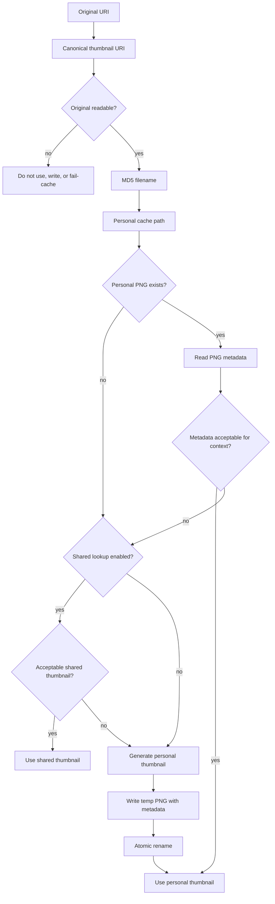

# Thumbnail Lifecycle

This document describes the intended data flow for reading, validating, creating, and pruning thumbnails.

## Lookup Flow

The personal thumbnail repository has priority over shared thumbnail repositories. If a personal thumbnail exists but is outdated or corrupt and shared lookup is enabled, the caller should check the shared repository before generating a new personal thumbnail. If an acceptable shared thumbnail is found, cleanup of the stale personal entry is a caller policy decision. Normal lookup must treat shared repositories as read-only; writing shared thumbnails requires an explicit shared-repository creation mode requested by the caller.

Shared thumbnail repositories are scoped to the directory that contains the original file. Shared-repository thumbnail URIs must be `./`-prefixed direct child filenames; they are not recursive paths and must reject parent segments, path separators, and encoded path separators.

## Validation Model

Validation must verify stored metadata against the original whenever the standard requires or permits it. For personal-cache thumbnails, missing `Thumb::URI`, a `Thumb::URI` mismatch against the canonical original URI, missing `Thumb::MTime`, or a `Thumb::MTime` mismatch is invalid because the standard requires these keys for identity and freshness checks. `Thumb::MTime` must be stored and compared as whole Unix epoch seconds. `Thumb::Size` should be checked when present.

Shared-repository validation is a separate context. When `Thumb::URI`, `Thumb::MTime`, or `Thumb::Size` is present, the library should compare it with the shared relative URI or original metadata. Missing `Thumb::URI` or `Thumb::MTime` is not automatically invalid for shared thumbnails because shared repositories may use other freshness mechanisms, so callers must decide whether an acceptable but not fully metadata-validated shared thumbnail is good enough for their use case.

The validation result should carry confidence separately from validity. A personal thumbnail with matching required metadata is fully verified. A shared thumbnail accepted despite missing `Thumb::URI` or `Thumb::MTime` is acceptable only under the caller's shared-repository policy and must not be reported as equivalent to a fully verified personal thumbnail. A management-tool inspection that did not read the original is an unchecked inspection result, not a display-valid thumbnail.

The library should compare modification times for equality, not only check whether the original is newer. A replacement file can have an older modification time than the thumbnail metadata, and that still means the thumbnail no longer represents the original.

## Creation Model

Thumbnail creation should be caller-driven and must start from a currently readable original. For local files, the library may provide a helper that opens the file and records its metadata. For non-local backends, the caller may provide an explicit original identity containing the canonical thumbnail URI, modification time, optional size, and proof that the original was readable through that backend. The library should provide the cache path, metadata writer, validation logic, and atomic save helper. Image decoding, document rendering, image-orientation handling, and video frame extraction should remain outside the core library unless a dedicated optional feature is added later.

This keeps the library useful for Kiriview without forcing the CLI to depend on image rendering stacks it does not need.

Creation must not run for originals located inside the personal thumbnail cache or a shared `.sh_thumbnails` repository. Those files are already cache artifacts and should be loaded directly by callers that need them.

The caller is responsible for rendering a thumbnail with the original aspect ratio preserved and source interpretation metadata such as Exif orientation applied. The library save helper should reject PNGs that are not 8-bit non-interlaced images with full alpha support, reject dimensions that exceed the selected size class, and require personal-cache metadata containing `Thumb::URI` and `Thumb::MTime`; it should include `Thumb::Size` when the original file size is available.

Application lookup must not use existing thumbnails when the original is not currently readable. Separate management-tool inspection may still parse thumbnail files and metadata without opening the original, but such inspection must report facts rather than validate the thumbnail for display.

Explicit shared-repository creation mode should use permissions consistent with the original files, not the personal-cache `700` directory and `600` file privacy policy.

## Failure Entries

The standard supports per-application failure entries under `thumbnails/fail/<program-version>/`. The library should model these as failure namespaces, not as thumbnail sizes. It should be able to locate and parse failure entries, but writing failure entries should require an explicit application identifier. Failure entries are PNG metadata carriers saved with the same URI-derived filename procedure as successful thumbnails and must carry at least `Thumb::URI` and `Thumb::MTime` for readable originals. They should be written as minimal valid PNG files, not zero-byte files, and successful-thumbnail size validation does not apply to them. Failure entries must not be written when the original is not currently readable.

Initial behavior: the CLI scans successful thumbnail entries by default and scans failure entries only with `--scope failures` or `--scope all`. This avoids deleting application-specific retry state without explicit user intent.
