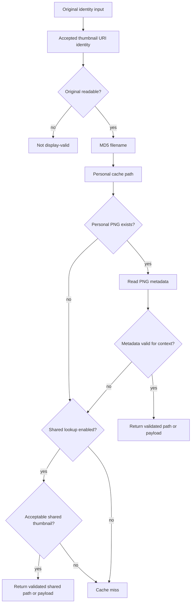
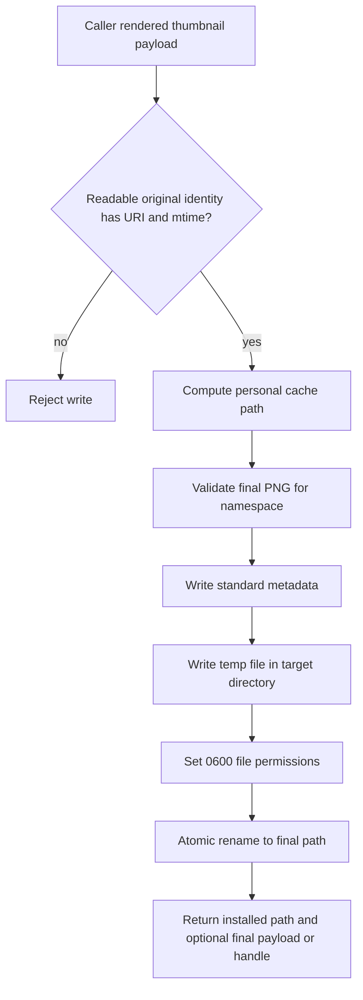

# Thumbnail Lifecycle

This document describes the intended data flow for reading, validating, inspecting, installing, and pruning thumbnails.

## Lookup Flow



The personal thumbnail repository has priority over shared thumbnail repositories. If a personal thumbnail exists but is outdated or corrupt and shared lookup is enabled, the caller should check the shared repository before reporting a cache miss. If caller policy chooses a shared entry, cleanup of the stale personal entry is a separate caller policy decision. Normal lookup must treat shared repositories as read-only; personal-cache writes use the explicit install lifecycle.

Shared thumbnail repositories are scoped to the directory that contains the original file. Shared lookup therefore requires a shared repository context, not only the personal-cache absolute URI: the context must identify the repository root, the direct child original filename, and the `./`-prefixed relative URI used for shared hashing and optional `Thumb::URI` comparison. Shared-repository thumbnail URIs are not recursive paths and must reject parent segments, slash path separators, and textual shared URI inputs containing encoded `/`. Raw direct-child filenames that contain percent-looking text remain valid filenames and must be percent-encoded rather than treated as URI text. On Unix-like targets, backslash is a filename byte and must be preserved through percent-encoding when needed.

## Validation Model

Validation must verify stored metadata against the original whenever the standard requires or permits it. For personal-cache thumbnails, missing `Thumb::URI`, a `Thumb::URI` mismatch against the canonical original URI, missing `Thumb::MTime`, or a `Thumb::MTime` mismatch is invalid because the standard requires these keys for identity and freshness checks. `Thumb::MTime` must be stored and compared as whole Unix epoch seconds. `Thumb::Size` should be checked when present.

Shared-repository validation is a separate context. When `Thumb::URI`, `Thumb::MTime`, or `Thumb::Size` is present, the library should compare it with the explicit shared relative URI or original metadata from the shared repository context. Missing `Thumb::URI` or `Thumb::MTime` is not automatically invalid for shared thumbnails because shared repositories may use other freshness mechanisms, so the library should report incomplete freshness metadata and callers must decide whether their use case can use that entry. Shared lookup APIs should make the acceptance policy visible: a safety-oriented policy may require present and matching shared freshness metadata, while a caller that wants to use standard-allowed shared thumbnails with incomplete metadata must choose an explicit acceptance policy.

The validation result should carry confidence separately from validity. A personal thumbnail with matching required metadata is fully verified. A shared thumbnail with missing `Thumb::URI` or `Thumb::MTime` is a policy-neutral incomplete-metadata result that callers may accept or reject under their own shared-repository policy; the library must not report it as equivalent to a fully verified personal thumbnail. A management-tool inspection that did not read the original is an unchecked inspection result, not a display-valid thumbnail.

The library should compare modification times for equality, not only check whether the original is newer. A replacement file can have an older modification time than the thumbnail metadata, and that still means the thumbnail no longer represents the original.

## Generation And Install Boundary

Thumbnail source creation is outside the base library and prune CLI scope. The generate CLI or embedding application owns generation orchestration: it discovers or selects the renderer, runs or calls it, and decides whether generation should be attempted. The selected renderer or thumbnailer owns source-format decoding, source interpretation, source metadata handling such as Exif orientation, and aspect-ratio-preserving scaling decisions for inputs such as PNG, WebP, documents, and video. The generate CLI validates the rendered output for cache conformance but does not inspect the original source format to repair renderer mistakes.

When the generate CLI runs external `.thumbnailer` helpers, it runs them in the configured thumbnailer sandbox before reading their temporary output. The default `--sandbox required` mode requires Linux `bubblewrap`; the default command fails before thumbnailer execution when that backend is unavailable and reports that no unsandboxed fallback is attempted. The initial sandbox backend provides a private mount namespace, unshared networking, read-only access to the selected input through sandbox-visible path and URI values, read-only access to documented system runtime locations needed by ordinary system thumbnailers, and write access only to the CLI-owned temporary output directory. User-controlled home, cache, config, and data directories are not exposed wholesale in the required sandbox unless a later compatibility mode explicitly changes that behavior. The generate CLI keeps the host canonical URI for cache identity, hashing, metadata, and validation separate from the sandbox-visible URI passed to thumbnailers through `%u`. The generate CLI is not required to infer arbitrary runtime dependencies for user-provided thumbnailers, plugins, codecs, configuration, helper programs, or shell command strings outside the documented profile; selected thumbnailers that do not fit the profile are reported as sandbox-ineligible and are not run under `--sandbox required`. Sandbox setup is not part of the base library because it belongs to external process execution rather than cache validation or installation.

The library owns the Freedesktop installation mechanics for personal-cache entries once a caller supplies a readability-confirmed original identity and an already rendered thumbnail payload. The caller owns renderer temporary files, including external thumbnailer `%o` outputs, until rendered output is handed to the library through a supported input form. The install path normalizes supported rendered PNG payloads to 8-bit non-interlaced RGBA PNG output with full alpha support, validates dimensions against the target namespace, writes standard metadata, creates missing cache directories with mode `0700`, rejects existing standard cache directories that are not current-user-owned and private, writes temporary files in the target directory, installs final files with mode `0600`, and publishes the result with an atomic rename. Source decoding, source metadata interpretation, animation frame selection, and repairing aspect-ratio mistakes remain outside the base library.

Shared-repository writes remain outside the initial lifecycle. Failure entry writing is an explicit library primitive because it uses the same Freedesktop filename, metadata, permission, and atomic-install rules, but callers own the policy for when a failure should be recorded. The initial failure writer creates a deterministic minimal 1x1 transparent RGBA PNG with required failure metadata instead of accepting a renderer-provided payload.

Application lookup must not use existing thumbnails when the original is not currently readable. Separate management-tool inspection may still parse thumbnail files and metadata without opening the original, but such inspection must report facts rather than validate the thumbnail for display.

## Lookup Result Surfaces

The library exposes cache reuse through layered result surfaces. A computed path is only the MD5-derived cache location for an accepted URI identity and namespace; it is useful for reports, dry-run output, and install targeting, but it does not mean a thumbnail exists or is valid. A validated path means the library opened the cache PNG and verified it against the original identity and namespace before returning the path; it is a convenience for toolkits that require a filename, but callers that reopen the path accept that the file can be replaced after validation. A validated payload or handle means the library returns the exact bytes or opened file handle that passed validation, plus the cache path and metadata facts; this is the preferred surface for application thumbnail views.

Lookup results should distinguish valid, missing, invalid, and unverifiable originals. Missing and invalid results let an application decide whether to render and install a new thumbnail. Unverifiable results mean the caller did not or could not provide readability and modification-time proof for the original, so the library must not present an existing cache entry as display-valid.

## Personal Install Flow



Applications that embed their own renderer should use this install flow instead of reimplementing the Freedesktop cache filename, metadata, permission, and atomic-save rules. The library should not know whether the payload came from Qt image decoding, a Rust image decoder, a document renderer, a video frame extractor, or an external thumbnailer. Install results should at least report the installed cache path. When the caller requests display-ready output, the library may return the final normalized PNG bytes or an opened handle for the installed entry; that payload represents the cache entry after metadata writing and normalization, not the original renderer input.

## Pruning Model

The library owns cache entry discovery, policy-neutral inspection facts, and low-level cache path safety. The prune CLI owns user-facing cleanup policy, report vocabulary, and destructive intent. A pruning run should therefore enumerate cache entries through the library, classify and decide in the prune CLI, then request deletion through a library cache entry handle only for entries that still pass containment checks and are not symlinks. Cache entry deletion should be implemented with directory-relative removal primitives such as `openat` and `unlinkat`, or a capability-style equivalent, where available; weaker fallbacks must be treated as best-effort rather than race-free.

Age-based cleanup defaults to thumbnail file access time, matching the Freedesktop deletion guidance's access-age wording for internet-related and removable-media thumbnails. The prune CLI should record thumbnail file metadata before parsing PNG content and should inspect PNG metadata through an access-time-preserving open or equivalent mechanism when age decisions depend on access time. If access time cannot be preserved for an entry, the prune CLI should skip access-time age deletion for that entry instead of letting a dry-run or report-only scan change later cleanup decisions. These access-time preservation skips are normal policy outcomes, not operational errors by themselves. Users can explicitly select modification-time cleanup as a more portable and more aggressive mode. The implementation may use access-time-preserving opens when available, such as `O_NOATIME` on Linux, but cleanup correctness must not depend on proving detailed access-time semantics for every mounted filesystem.

## Existing Thumbnail Lookup Target

A thumbnail consumer that only wants to reuse existing thumbnails should be able to use the library through a flow equivalent to:

```rust
let uri = ThumbnailUri::from_file_path(path)?;
let original = OriginalFile::open_readable(path)?;
let identity = ReadableOriginalIdentity::from_readable_file(&uri, &original)?;
let computed_path = cache.thumbnail_path(&uri, CacheNamespace::Size(ThumbnailSize::Normal));

match cache.read_valid_thumbnail(&identity, ThumbnailSize::Normal)? {
    ThumbnailLookup::Valid(thumbnail) => return Ok(Some(thumbnail)),
    ThumbnailLookup::Missing | ThumbnailLookup::Invalid(_) => {}
    ThumbnailLookup::Unverifiable(_) => return Ok(None),
}

let shared = SharedRepositoryContext::for_direct_child(path)?;
let shared_policy = SharedLookupPolicy::RequireFreshnessMetadata;
match cache.read_valid_shared_thumbnail(&shared, &identity, shared_policy)? {
    ThumbnailLookup::Valid(thumbnail) => return Ok(Some(thumbnail)),
    ThumbnailLookup::Missing | ThumbnailLookup::Invalid(_) => {}
    ThumbnailLookup::Unverifiable(_) => return Ok(None),
}

Ok(None)
```

The exact API should be shaped by implementation, but applications should not need to know the hash filename algorithm, cache directory layout, or PNG metadata keys directly. `computed_path` is available for diagnostics or reports, while `read_valid_thumbnail` returns a display-grade validated payload or handle rather than asking the caller to reopen a path and reparse metadata. A cache miss is returned to the caller; lookup does not perform rendering, and callers that render a thumbnail use the separate install flow. The example uses a safety-oriented shared policy that can decline standard-allowed shared thumbnails with incomplete freshness metadata. Applications that intentionally accept shared thumbnails with incomplete freshness metadata should pass an explicit shared policy tied to their own trust or freshness model.

## Failure Entries

The standard supports per-program-version failure entries under `thumbnails/fail/<program-version>/`. The library should model these as failure namespaces, not as thumbnail sizes. It should be able to locate, parse, inspect, and explicitly write failure entries. Failure-entry writes require the caller to provide a validated direct directory namespace and a readability-confirmed original identity; the library must not decide when a failed render should suppress future attempts. Failure entries are PNG metadata carriers named with the same URI-derived filename procedure as successful thumbnails, and successful-thumbnail size validation does not apply to them. The initial writer should generate a minimal 1x1 transparent RGBA PNG with `Thumb::URI` and `Thumb::MTime`, plus optional caller-supplied original metadata.

Initial behavior: the prune CLI scans successful thumbnail entries by default and scans failure entries only with `--scope failures` or `--scope all`. This avoids touching application-specific retry state without explicit user intent. Once failure entries are in scope, the prune CLI should inspect and classify them like successful thumbnails because the user is asking to manage cache entries for the same original URI identity; the special cases are that successful-thumbnail dimension validation does not apply and deletion requires `--allow-delete-failures` in addition to `--delete`.

Failure iteration should treat only immediate real directories below `fail/` as program-version namespaces and should inspect only direct child files inside each namespace. Symlinked namespace directories and nested directories are skipped so failure scanning cannot escape the intended cache shape.
