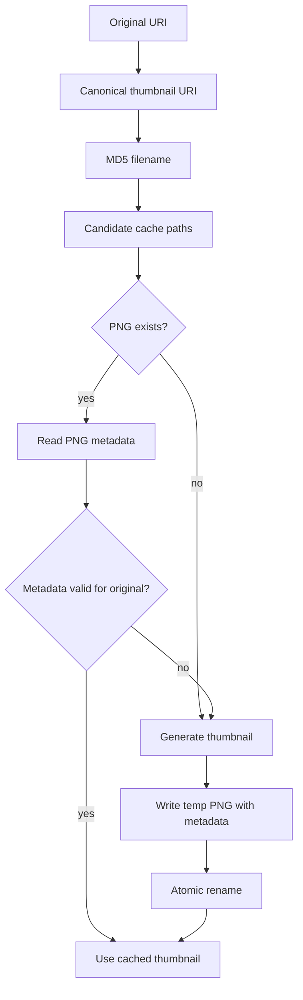

# Thumbnail Lifecycle

This document describes the intended data flow for reading, validating, creating, and pruning thumbnails.

## Lookup Flow

The personal thumbnail repository has priority over shared thumbnail repositories. If a personal thumbnail exists but is outdated or corrupt, the caller may check a shared repository before generating a new personal thumbnail.

## Validation Model

Validation should use the stored `Thumb::URI`, `Thumb::MTime`, and `Thumb::Size` metadata when present. For global thumbnails, missing `Thumb::MTime` is invalid because the standard requires it for freshness checks. For shared thumbnails, missing freshness metadata is not automatically invalid because shared repositories may use other freshness mechanisms.

The library should compare modification times for equality, not only check whether the original is newer. A replacement file can have an older modification time than the thumbnail metadata, and that still means the thumbnail no longer represents the original.

## Creation Model

Thumbnail creation should be caller-driven. The library should provide the cache path, metadata writer, validation logic, and atomic save helper. Image decoding, document rendering, and video frame extraction should remain outside the core library unless a dedicated optional feature is added later.

This keeps the library useful for Kiriview without forcing the CLI to depend on image rendering stacks it does not need.

## Failure Entries

The standard supports per-application failure entries under `thumbnails/fail/<program-version>/`. The library should be able to locate and parse failure entries, but writing failure entries should require an explicit application identifier.

Initial behavior: the CLI does not prune failure entries unless `--include-failures` is passed. This avoids deleting application-specific retry state without explicit user intent.
