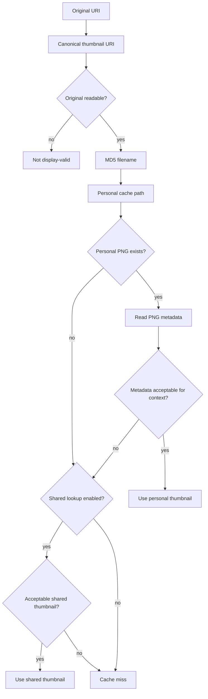
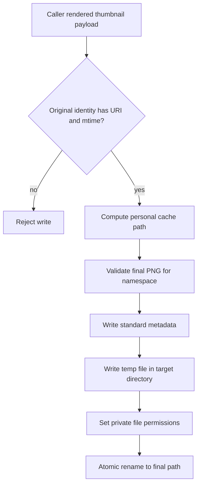

# Thumbnail Lifecycle

This document describes the intended data flow for reading, validating, inspecting, installing, and pruning thumbnails.

## Lookup Flow



The personal thumbnail repository has priority over shared thumbnail repositories. If a personal thumbnail exists but is outdated or corrupt and shared lookup is enabled, the caller should check the shared repository before reporting a cache miss. If an acceptable shared thumbnail is found, cleanup of the stale personal entry is a caller policy decision. Normal lookup must treat shared repositories as read-only; personal-cache writes use the explicit install lifecycle.

Shared thumbnail repositories are scoped to the directory that contains the original file. Shared-repository thumbnail URIs must be `./`-prefixed direct child filenames; they are not recursive paths and must reject parent segments, path separators, and encoded path separators.

## Validation Model

Validation must verify stored metadata against the original whenever the standard requires or permits it. For personal-cache thumbnails, missing `Thumb::URI`, a `Thumb::URI` mismatch against the canonical original URI, missing `Thumb::MTime`, or a `Thumb::MTime` mismatch is invalid because the standard requires these keys for identity and freshness checks. `Thumb::MTime` must be stored and compared as whole Unix epoch seconds. `Thumb::Size` should be checked when present.

Shared-repository validation is a separate context. When `Thumb::URI`, `Thumb::MTime`, or `Thumb::Size` is present, the library should compare it with the shared relative URI or original metadata. Missing `Thumb::URI` or `Thumb::MTime` is not automatically invalid for shared thumbnails because shared repositories may use other freshness mechanisms, so callers must decide whether an acceptable but not fully metadata-validated shared thumbnail is good enough for their use case.

The validation result should carry confidence separately from validity. A personal thumbnail with matching required metadata is fully verified. A shared thumbnail accepted despite missing `Thumb::URI` or `Thumb::MTime` is acceptable only under the caller's shared-repository policy and must not be reported as equivalent to a fully verified personal thumbnail. A management-tool inspection that did not read the original is an unchecked inspection result, not a display-valid thumbnail.

The library should compare modification times for equality, not only check whether the original is newer. A replacement file can have an older modification time than the thumbnail metadata, and that still means the thumbnail no longer represents the original.

## Generation And Install Boundary

Thumbnail source creation is outside the base library and prune CLI scope. The generate CLI or embedding application owns generation orchestration: it discovers or selects the renderer, decodes source formats, applies source metadata such as orientation, scales image data, and decides whether generation should be attempted. Source-format decoding and rendering for inputs such as PNG, WebP, documents, and video remain the responsibility of the selected thumbnailer helper or embedding application.

The library owns the Freedesktop installation mechanics for personal-cache entries once a caller supplies a complete original identity and an already rendered in-memory thumbnail payload. The initial install API should accept PNG bytes as the primary payload and may later expose narrow raw pixel convenience inputs. The caller owns renderer temporary files, including external thumbnailer `%o` outputs, and reads them before calling the library. The install path validates the final PNG against the target namespace, writes standard metadata, creates private cache directories and final files, writes temporary files in the target directory, and publishes the result with an atomic rename.

Shared-repository writes remain outside the initial lifecycle. Failure entry writing is an explicit library primitive because it uses the same Freedesktop filename, metadata, permission, and atomic-install rules, but callers own the policy for when a failure should be recorded.

Application lookup must not use existing thumbnails when the original is not currently readable. Separate management-tool inspection may still parse thumbnail files and metadata without opening the original, but such inspection must report facts rather than validate the thumbnail for display.

## Personal Install Flow



Applications that embed their own renderer should use this install flow instead of reimplementing the Freedesktop cache filename, metadata, permission, and atomic-save rules. The library should not know whether the payload came from Qt image decoding, a Rust image decoder, a document renderer, a video frame extractor, or an external thumbnailer.

## Pruning Model

The library owns cache entry discovery, policy-neutral inspection facts, and low-level cache path safety. The prune CLI owns user-facing cleanup policy, report vocabulary, and destructive intent. A pruning run should therefore enumerate cache entries through the library, classify and decide in the prune CLI, then request deletion through a library cache entry handle only for entries that still pass containment checks and are not symlinks. Cache entry deletion should be implemented with directory-relative removal primitives such as `openat` and `unlinkat`, or a capability-style equivalent, where available; weaker fallbacks must be treated as best-effort rather than race-free.

Access-time based cleanup should record thumbnail file metadata before parsing PNG content and should inspect PNG metadata through an access-time-preserving open or equivalent mechanism when age decisions depend on access time. If access time cannot be preserved for an entry, the prune CLI should skip access-time age deletion for that entry instead of letting a dry-run or report-only scan change later cleanup decisions. The implementation may use access-time-preserving opens when available, such as `O_NOATIME` on Linux, but cleanup correctness must not depend on proving detailed access-time semantics for every mounted filesystem.

## Existing Thumbnail Lookup Target

A thumbnail consumer that only wants to reuse existing thumbnails should be able to use the library through a flow equivalent to:

```rust
let uri = ThumbnailUri::from_file_path(path)?;
let original = OriginalFile::open_readable(path)?;
let identity = OriginalIdentity::from_readable_file(&uri, &original)?;
let cache_path = cache.thumbnail_path(&uri, CacheNamespace::Size(ThumbnailSize::Normal));

if cache.is_valid(&cache_path, &identity)?.is_fully_verified() {
    return Ok(Some(cache_path));
}

if let Some(shared_path) = cache.find_acceptable_shared(&uri, &identity)? {
    return Ok(Some(shared_path));
}

Ok(None)
```

The exact API should be shaped by implementation, but applications should not need to know the hash filename algorithm, cache directory layout, or PNG metadata keys directly. A cache miss is returned to the caller; lookup does not perform rendering, and callers that render a thumbnail use the separate install flow.

## Failure Entries

The standard supports per-program-version failure entries under `thumbnails/fail/<program-version>/`. The library should model these as failure namespaces, not as thumbnail sizes. It should be able to locate, parse, inspect, and explicitly write failure entries. Failure-entry writes require the caller to provide the program-version namespace and original identity; the library must not decide when a failed render should suppress future attempts. Failure entries are PNG metadata carriers named with the same URI-derived filename procedure as successful thumbnails, and successful-thumbnail size validation does not apply to them.

Initial behavior: the prune CLI scans successful thumbnail entries by default and scans failure entries only with `--scope failures` or `--scope all`. This avoids touching application-specific retry state without explicit user intent. Once failure entries are in scope, the prune CLI should inspect and classify them like successful thumbnails because the user is asking to manage cache entries for the same original URI identity; the special cases are that successful-thumbnail dimension validation does not apply and deletion requires `--allow-delete-failures` in addition to `--delete`.

Failure iteration should treat only immediate real directories below `fail/` as program-version namespaces and should inspect only direct child files inside each namespace. Symlinked namespace directories and nested directories are skipped so failure scanning cannot escape the intended cache shape.
